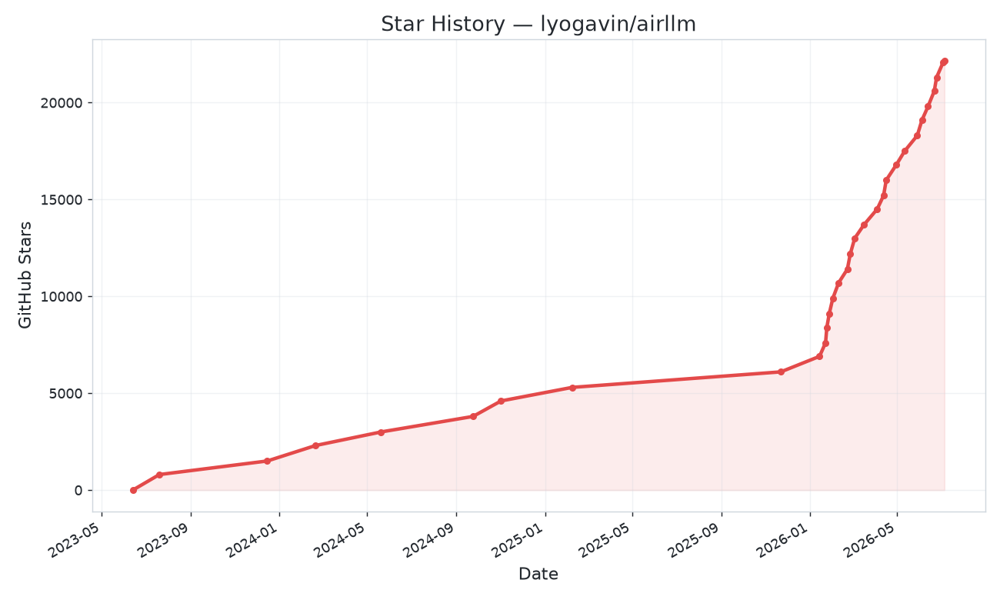

[**Quickstart**](#quickstart) |
[**Fork Highlights**](#fork-highlights) |
[**Local UI**](#local-ui-chat-and-coding-agent) |
[**Configurations**](#configurations) |
[**Supported Models**](#supported-models) |
[**MacOS**](#macos) |
[**Example notebooks**](#example-python-notebook) |
[**FAQ**](#faq)

**AirLLM** dramatically reduces inference memory usage, letting 70B large language models run on a single 4GB GPU card — without quantization, distillation, or pruning. You can even run **405B Llama 3.1** on **8GB**, and **DeepSeek-V3 (671B)** on **~12GB**.

<a href="https://github.com/lyogavin/airllm/stargazers"></a>
[](https://pepy.tech/project/airllm)

[](https://github.com/LianjiaTech/BELLE/blob/main/LICENSE)
[](https://static.aicompose.cn/static/wecom_barcode.png?t=1671918938)
[](https://discord.gg/2xffU5sn)
[
](https://pypi.org/project/airllm/)
[](https://medium.com/@lyo.gavin)
[](https://gavinliblog.com)
[](https://patreon.com/gavinli)
[](https://github.com/sponsors/lyogavin)

## Fork Highlights

This repository tracks upstream AirLLM and adds a local desktop-friendly app
layer for running, testing, and chatting with large models from one workspace.

* Local browser UI served by `airllm_ui.py`, with a React/Vite frontend in `ui/`.
* Hardware-aware defaults for CUDA, CPU, Apple Metal/MPS, and CPU+GPU hybrid mode.
* ChatUI for local AirLLM models or OpenAI-compatible external providers.
* Review-only Coding Agent mode that reads workspace context and proposes changes
  without automatically writing files.
* Terminal helpers through `airllm.cmd`, `airllm-agent.cmd`, and `airllm_cli.py`.
* Model search/download controls, download progress, cancellation, and local cache
  inspection.
* Runtime tuning for dtype, compression, prefetching, cleanup interval, sequence
  length, layer cache path, and benchmark checks.

## AI Agents Recommendation:

* [Best AI Game Sprite Generator](https://godmodeai.co)

* [Best AI Facial Expression Editor](https://crazyfaceai.com)

* [Bloome — build & run AI agent teams in the cloud, zero setup](https://bloome.im/app?ref=G6BYnov0&utm_medium=github&utm_source=lyogavin-airllm-ivor-202606)

## Updates
[2026/07] Fork refreshed with upstream AirLLM v3 changes plus local UI, CLI,
external-provider chat, model download controls, MPS detection, CPU+GPU hybrid
mode, and coding-agent documentation.

[2026/06] **v3.0**: FP8 model support + the latest models. Run **DeepSeek-V3 (671B) on ~12GB** and **Qwen3-235B on ~3GB**, plus Qwen3, Llama 3.x/4, DeepSeek V2/V3, Phi-4, Gemma and more — all through a single `AutoModel`.

[2024/08/20] v2.11.0: Support Qwen2.5

[2024/08/18] v2.10.1 Support CPU inference. Support non sharded models. Thanks @NavodPeiris for the great work! 

[2024/07/30] Support Llama3.1 **405B** ([example notebook](https://colab.research.google.com/github/lyogavin/airllm/blob/main/air_llm/examples/run_llama3.1_405B.ipynb)). Support **8bit/4bit quantization**.

[2024/04/20] AirLLM supports Llama3 natively already. Run Llama3 70B on 4GB single GPU.

[2023/12/25] v2.8.2: Support MacOS running 70B large language models.

[2023/12/20] v2.7: Support AirLLMMixtral. 

[2023/12/20] v2.6: Added AutoModel, automatically detect model type, no need to provide model class to initialize model.

[2023/12/18] v2.5: added prefetching to overlap the model loading and compute. 10% speed improvement.

[2023/12/03] added support of **ChatGLM**, **QWen**, **Baichuan**, **Mistral**, **InternLM**!

[2023/12/02] added support for safetensors. Now support all top 10 models in open llm leaderboard.

[2023/12/01] airllm 2.0. Support compressions: **3x run time speed up!**

[2023/11/20] airllm Initial version!

## Star History

<a href="https://star-history.com/#lyogavin/airllm&Timeline">
  <picture>
    <source media="(prefers-color-scheme: dark)" srcset="assets/star-history-dark.png">
    
  </picture>
</a>

## Table of Contents

* [Quick start](#quickstart)
* [Fork Highlights](#fork-highlights)
* [Local UI, Chat and Coding Agent](#local-ui-chat-and-coding-agent)
* [Model Compression](#model-compression---3x-inference-speed-up)
* [Configurations](#configurations)
* [Run on MacOS](#macos)
* [Example notebooks](#example-python-notebook)
* [Supported Models](#supported-models)
* [Acknowledgement](#acknowledgement)
* [FAQ](#faq)

## Quickstart

### 1. Install package

First, install the AirLLM pip package.

```bash
pip install airllm
```

When running this fork from source, use the project environment and install the
checked-in dependency set:

```powershell
.\.venv\Scripts\python.exe -m pip install -r requirements.txt
```

### 2. Inference

Then initialize `AutoModel` with a Hugging Face repo ID or a local model path.
Generation works similarly to a regular Transformers causal language model.

You can also set `layer_shards_saving_path` when loading the model to choose
where AirLLM stores the split layer cache.

```python
from airllm import AutoModel

MAX_LENGTH = 128
# just pass a hugging face repo id — works with almost any popular model:
model = AutoModel.from_pretrained("Qwen/Qwen3-32B")

# go bigger with the exact same one line:
#model = AutoModel.from_pretrained("Qwen/Qwen3-235B-A22B")     # 235B, runs in ~3GB
#model = AutoModel.from_pretrained("deepseek-ai/DeepSeek-V3")  # 671B, runs in ~12GB

# or use a model's local path...
#model = AutoModel.from_pretrained("/home/ubuntu/.cache/huggingface/hub/models--Qwen--Qwen3-32B/snapshots/...")

input_text = [
        'What is the capital of United States?',
        #'I like',
    ]

input_tokens = model.tokenizer(input_text,
    return_tensors="pt", 
    return_attention_mask=False, 
    truncation=True, 
    max_length=MAX_LENGTH, 
    padding=False)
           
generation_output = model.generate(
    input_tokens['input_ids'].cuda(), 
    max_new_tokens=20,
    use_cache=True,
    return_dict_in_generate=True)

output = model.tokenizer.decode(generation_output.sequences[0])

print(output)

```
 
 
Note: During inference, the original model will first be decomposed and saved layer-wise. Please ensure there is sufficient disk space in the huggingface cache directory.
 

## Local UI, Chat and Coding Agent

This fork also includes a responsive local browser UI built with React, Vite,
Tailwind, and shadcn/ui-style components. It can run AirLLM locally, expose a
ChatUI, start a review-only coding agent, and connect to external
OpenAI-compatible AI providers.

Start the backend and production UI:

```powershell
.\.venv\Scripts\python.exe airllm_ui.py
```

Open `http://127.0.0.1:7860`.

If `ui/dist` is missing or you changed the frontend, rebuild the production UI:

```powershell
cd ui
npm install
npm run build
cd ..
```

The UI includes:

* hardware-aware defaults for CUDA/CPU, dtype, prefetching, and sequence length
* diagnostics for CUDA, RAM, Hugging Face cache disk space, Windows power mode,
  WiFi link, PyTorch, and bitsandbytes
* a local benchmark button for GPU/CPU matrix throughput and cache disk read/write
* responsive mobile-to-desktop layout with stacked panels and full-width mobile actions
* supported AirLLM model presets plus custom Hugging Face model IDs or local paths
  including Qwen2.5 Coder 3B/7B presets for local coding-agent use
* performance controls for `cleanup_interval`, `prefetch_workers`, and the
  compatibility-only `reinitialize_model_each_forward` mode
* ChatUI backed by the selected local model or external provider
* one-button Coding Agent mode that reads workspace context and returns a plan,
  proposed changes, and test suggestions without automatically editing files
* external AI provider mode for OpenAI-compatible `/v1/chat/completions` APIs,
  including services such as OpenAI, OpenRouter, Groq, Together AI, Mistral AI,
  LM Studio, and Ollama-compatible local servers
* a Stop button for interrupting local AirLLM generation through Transformers
  stopping criteria

For frontend development:

```powershell
cd ui
npm install
npm run dev
```

Terminal client examples while the backend is running:

```powershell
.\airllm.cmd status
.\airllm.cmd models
.\airllm.cmd hf-search "Qwen2.5 Coder"
.\airllm.cmd download Qwen/Qwen2.5-Coder-3B-Instruct
.\airllm.cmd download-status
.\airllm.cmd agent "Review this workspace and suggest performance improvements" --workspace .
```

See [README_UI.md](README_UI.md) for the full UI, ChatUI, Coding Agent, and
external provider setup notes.

### How the fork decides where to run your model

Upstream AirLLM always streams a model layer-by-layer from disk — robust, but it
costs *seconds per token*. This fork adds a resident fast path and picks one of
three strategies automatically at load time (`plan_load_strategy`), based on the
model's estimated size and your free VRAM/RAM:

| Strategy | What it does | Speed | Chosen when |
|---|---|---|---|
| `direct_gpu` | Plain resident `transformers` model, all layers on the GPU (SDPA attention) | Fast — ~16 tok/s on a 3B, bandwidth-bound ceiling ~28 tok/s bf16 | Estimated weights fit free VRAM minus a ~1 GB reserve |
| `direct_offload` | Resident model split across VRAM+RAM (+disk) via Accelerate `device_map="auto"` | A few tok/s — nothing is re-streamed per token | CUDA only, weights fit the combined budget `int(free_VRAM×0.8) + int(free_RAM×0.6)` GiB |
| `airllm` | Upstream layer-by-layer disk streaming | Slowest — seconds/token | Nothing else fits, no accelerator, or compression / an AirLLM-only feature is requested |

* The **default dtype** is `bfloat16` on bf16-capable GPUs (Ampere+/Blackwell) and
  `float16` otherwise — bf16 has the same memory and speed as fp16 but a wider
  exponent range, avoiding overflow→NaN on bf16-trained models (Qwen, Llama).
* If a resident load fails (OOM, missing quant kernel, config error) the server
  **falls back to AirLLM streaming** automatically, so loading never hard-fails on
  a too-optimistic size estimate.
* Override the choice with `load_mode`: `auto` (default), `direct`, `hybrid`
  (force `direct_offload`), or `airllm`.
* On an 8 GB-class GPU with no quantization libraries installed, resident bf16
  comfortably covers ~3B models; ~4–6B models land on `direct_offload`; larger
  ones stream via AirLLM.

### HTTP and SSE API

The backend is a dependency-free `http.server` app that serves the built UI plus a
small JSON API — everything the UI does is scriptable against
`http://127.0.0.1:7860`.

**GET**

| Endpoint | Returns |
|---|---|
| `/api/hardware` | Full hardware/software profile + recommended load settings |
| `/api/presets` | Curated model presets and supported families |
| `/api/providers` | External OpenAI-compatible provider presets |
| `/api/status` | Lock-free snapshot of the loaded model (stays responsive mid-generation) |
| `/api/models` | Locally cached HF models with sizes + current download state |
| `/api/hf-models?q=…` | Search the Hugging Face Hub |
| `/api/download/status` | Progress of the in-flight download |

**POST** (JSON body)

| Endpoint | Purpose |
|---|---|
| `/api/load` | Load a model (`model_id`, `device`, `dtype`, `load_mode`, `max_seq_len`, …) |
| `/api/generate` | Single-prompt generation; `stream:true` → SSE for local models |
| `/api/chat` | Multi-turn chat (`messages`, `system_prompt`); `stream:true` → SSE |
| `/api/agent/run` | Read-only coding agent over a workspace |
| `/api/unload` | Free the resident model |
| `/api/cancel` | Cooperatively stop the running generation |
| `/api/optimize` | Apply CPU-thread / TF32 / cuDNN tuning |
| `/api/benchmark` | GPU/CPU matmul + cache-disk read/write micro-benchmark |
| `/api/models/delete` | Delete a cached model |
| `/api/download`, `/api/download/cancel` | Start / cancel a background HF download |

`/api/generate` and `/api/chat` switch to **Server-Sent Events** when `stream:true`
and the provider is local: the response opens `200` immediately and emits `data:`
token events, so an error mid-stream arrives as a data event rather than a failed
request. The `done` event carries real `output_tokens` and tokens/sec.

```bash
# non-streaming generation against an already-loaded model
curl -s http://127.0.0.1:7860/api/generate \
  -d '{"prompt":"Write a haiku about disk I/O","task_mode":"chat","max_new_tokens":64}'
```

### Local performance changes in this fork

This fork also includes runtime fixes aimed at better laptop/desktop hardware
usage:

* AirLLM no longer rebuilds the meta model on every `forward()` by default.
  Set `reinitialize_model_each_forward=True` only if a specific architecture
  needs the older compatibility behavior.
* CUDA/Python memory cleanup is now throttled by `cleanup_interval` instead of
  forcing `gc.collect()` and `torch.cuda.empty_cache()` after every layer.
  The UI recommends `4` for CUDA systems and keeps `1` available for safer,
  lower-memory fallback runs.
* Prefetch pinned-memory now assigns the pinned tensors back into the state dict,
  so the prefetch path can actually benefit from page-locked CPU memory.
* Transformers `DynamicCache` is used for modern rotary decoder models when
  `use_cache=True`; unsupported/batched cases fall back to cache-free inference.
* The package installer no longer performs a post-install `pip install --upgrade
  transformers`, making environments more reproducible.
* `requirements.txt` now uses version ranges instead of old git-main pins.
  `bitsandbytes` is documented as optional because Windows/CUDA wheel support
  depends on the exact Python and CUDA combination.

Newer resident-path levers (the model stays in memory and only what is *provably*
worth tuning gets tuned — a disk-streaming re-load dominates everything else):

* **Long context is no longer silently truncated.** Resident models size the
  prompt budget from the model's trained context (`max_position_embeddings`,
  capped at 32k) instead of a flat 512 tokens, so RAG / long-file / coding-agent
  prompts keep their content. Chat trimming drops the oldest turns first and
  preserves the system prompt.
* **Offloaded KV cache.** When the estimated KV cache would overflow free VRAM,
  the server streams it to CPU RAM (`cache_implementation="offloaded"`, lossless)
  so long generations survive on 8 GB instead of OOMing; small KV stays on the
  fast VRAM path.
* **Prompt-lookup decoding** (n-gram speculative decode, zero extra VRAM) is on by
  default for the greedy `code` task mode and opt-in elsewhere: ~1.5–3× faster on
  output that quotes its context (code edits, refactors, JSON, RAG), and identical
  output under greedy decoding.
* **RAM-offload instead of disk-streaming.** Models that miss VRAM but fit the
  combined VRAM+RAM budget load resident across GPU+CPU (`direct_offload`) rather
  than dropping to per-token AirLLM streaming.
* **Safe streaming teardown.** A cancelled or disconnected SSE stream signals
  cancel and joins the generation worker before releasing the model lock, so an
  orphaned `generate()` cannot pin the GPU or race the next request.

Recommended defaults for this machine class:

* Device: `cuda:0`
* dtype: `bfloat16` on bf16-capable GPUs (RTX 30xx+/Blackwell), else `float16`
* compression: `none` until a compatible `bitsandbytes` wheel is installed
* prefetching: `on`
* cleanup interval: `4`
* prefetch workers: `1`
* max sequence length: `1024` for 8 GB class GPUs, lower it to `512` if you hit
  VRAM pressure
* Hugging Face/layer cache: place `HF_HOME` or `layer_shards_saving_path` on the
  fastest NVMe SSD with plenty of free space
* Windows power mode: use a performance profile while benchmarking or running
  long generations; Balanced can throttle sustained CPU/GPU work
* Network: prefer the strongest WiFi 6/7 or wired link for first model downloads


## Model Compression - 3x Inference Speed Up!

We just added model compression based on block-wise quantization-based model compression. Which can further **speed up the inference speed** for up to **3x** , with **almost ignorable accuracy loss!** (see more performance evaluation and why we use block-wise quantization in [this paper](https://arxiv.org/abs/2212.09720))


#### How to enable model compression speed up:

* Step 1. make sure you have [bitsandbytes](https://github.com/TimDettmers/bitsandbytes) installed by `pip install -U bitsandbytes `
* Step 2. make sure airllm verion later than 2.0.0: `pip install -U airllm` 
* Step 3. when initialize the model, passing the argument compression ('4bit' or '8bit'):

```python
model = AutoModel.from_pretrained("garage-bAInd/Platypus2-70B-instruct",
                     compression='4bit' # specify '8bit' for 8-bit block-wise quantization 
                    )
```

#### What are the differences between model compression and quantization?

Quantization normally needs to quantize both weights and activations to really speed things up. Which makes it harder to maintain accuracy and avoid the impact of outliers in all kinds of inputs.

While in our case the bottleneck is mainly at the disk loading, we only need to make the model loading size smaller. So, we get to only quantize the weights' part, which is easier to ensure the accuracy.

## Configurations
 
When initialize the model, we support the following configurations:

* **compression**: supported options: 4bit, 8bit for 4-bit or 8-bit block-wise quantization, or by default None for no compression
* **profiling_mode**: supported options: True to output time consumptions or by default False
* **layer_shards_saving_path**: optionally another path to save the split model cache
* **hf_token**: huggingface token can be provided here if downloading gated models like: *meta-llama/Llama-2-7b-hf*
* **prefetching**: prefetching to overlap the model loading and compute. By default, turned on for AirLLM streaming paths where supported.
* **cleanup_interval**: how often AirLLM runs deeper memory cleanup while streaming layers. `1` matches the original conservative behavior; `4` is the UI default for CUDA systems to reduce allocator churn.
* **prefetch_workers**: number of background layer-load workers. `1` is usually best because layer order is sequential and avoids SSD/RAM contention.
* **reinitialize_model_each_forward**: compatibility switch for the old behavior that rebuilt the meta model on every forward pass. Keep this `False` for speed unless a model family requires it.
* **delete_original**: if you don't have too much disk space, you can set delete_original to true to delete the original downloaded hugging face model, only keep the transformed one to save half of the disk space. 

## MacOS

Just install airllm and run the code the same as on linux. See more in [Quick Start](#quickstart).

* make sure you installed [mlx](https://github.com/ml-explore/mlx?tab=readme-ov-file#installation) and torch
* you probably need to install python native see more [here](https://stackoverflow.com/a/65432861/21230266)
* only [Apple silicon](https://support.apple.com/en-us/HT211814) is supported

Example [python notebook] (https://github.com/lyogavin/airllm/blob/main/air_llm/examples/run_on_macos.ipynb)


## Example Python Notebook

Example colabs here:

<a target="_blank" href="https://colab.research.google.com/github/lyogavin/airllm/blob/main/air_llm/examples/run_all_types_of_models.ipynb">
  
</a>

#### example of other models (ChatGLM, QWen, Baichuan, Mistral, etc):

<details>


* ChatGLM:

```python
from airllm import AutoModel
MAX_LENGTH = 128
model = AutoModel.from_pretrained("THUDM/chatglm3-6b-base")
input_text = ['What is the capital of China?',]
input_tokens = model.tokenizer(input_text,
    return_tensors="pt", 
    return_attention_mask=False, 
    truncation=True, 
    max_length=MAX_LENGTH, 
    padding=True)
generation_output = model.generate(
    input_tokens['input_ids'].cuda(), 
    max_new_tokens=5,
    use_cache= True,
    return_dict_in_generate=True)
model.tokenizer.decode(generation_output.sequences[0])
```

* QWen:

```python
from airllm import AutoModel
MAX_LENGTH = 128
model = AutoModel.from_pretrained("Qwen/Qwen-7B")
input_text = ['What is the capital of China?',]
input_tokens = model.tokenizer(input_text,
    return_tensors="pt", 
    return_attention_mask=False, 
    truncation=True, 
    max_length=MAX_LENGTH)
generation_output = model.generate(
    input_tokens['input_ids'].cuda(), 
    max_new_tokens=5,
    use_cache=True,
    return_dict_in_generate=True)
model.tokenizer.decode(generation_output.sequences[0])
```


* Baichuan, InternLM, Mistral, etc:

```python
from airllm import AutoModel
MAX_LENGTH = 128
model = AutoModel.from_pretrained("baichuan-inc/Baichuan2-7B-Base")
#model = AutoModel.from_pretrained("internlm/internlm-20b")
#model = AutoModel.from_pretrained("mistralai/Mistral-7B-Instruct-v0.1")
input_text = ['What is the capital of China?',]
input_tokens = model.tokenizer(input_text,
    return_tensors="pt", 
    return_attention_mask=False, 
    truncation=True, 
    max_length=MAX_LENGTH)
generation_output = model.generate(
    input_tokens['input_ids'].cuda(), 
    max_new_tokens=5,
    use_cache=True,
    return_dict_in_generate=True)
model.tokenizer.decode(generation_output.sequences[0])
```


</details>


#### To request other model support: [here](https://docs.google.com/forms/d/e/1FAIpQLSe0Io9ANMT964Zi-OQOq1TJmnvP-G3_ZgQDhP7SatN0IEdbOg/viewform?usp=sf_link)


## Supported Models

AirLLM works out of the box with **virtually every popular open LLM** — just pass its Hugging Face ID to `AutoModel.from_pretrained(...)`. That covers all the major families:

**Llama** (2 / 3 / 3.1 / 3.3 / 4) · **Qwen** (1 / 2 / 2.5 / 3, including MoE and FP8) · **DeepSeek** (V2 / V3 / R1) · **Mistral & Mixtral** · **Phi** · **Gemma** · **ChatGLM** · **Baichuan** · **InternLM** · **Yi** — and most new models the day they're released.

### Tiny GPU, huge models

The trick: AirLLM only ever keeps **one layer on the GPU at a time**, so the VRAM you need depends on the model's layer size — not its total size. That's how a 671B model fits on a hobbyist card:

| Model | Size | GPU VRAM |
|---|---|---|
| Qwen3 / Mistral / Phi (≈8B) | 8B | **~1–2 GB** |
| Qwen3-30B / Mixtral (MoE) | 30–47B | **~1–3 GB** |
| Qwen3-235B (MoE) | 235B | **~3 GB** |
| Llama 3.x 70B (full precision) | 70B | **~4 GB** |
| Llama 3.1 405B | 405B | **~8 GB** |
| DeepSeek-V3 | **671B** | **~12 GB** |

Same one line of code for all of them — no special setup.

## Acknowledgement

A lot of the code are based on SimJeg's great work in the Kaggle exam competition. Big shoutout to SimJeg:

[GitHub account @SimJeg](https://github.com/SimJeg), 
[the code on Kaggle](https://www.kaggle.com/code/simjeg/platypus2-70b-with-wikipedia-rag), 
[the associated discussion](https://www.kaggle.com/competitions/kaggle-llm-science-exam/discussion/446414).


## FAQ

### 1. MetadataIncompleteBuffer

safetensors_rust.SafetensorError: Error while deserializing header: MetadataIncompleteBuffer

If you run into this error, most possible cause is you run out of disk space. The process of splitting model is very disk-consuming. See [this](https://huggingface.co/TheBloke/guanaco-65B-GPTQ/discussions/12). You may need to extend your disk space, clear huggingface [.cache](https://huggingface.co/docs/datasets/cache) and rerun. 

### 2. ValueError: max() arg is an empty sequence

Most likely you are loading QWen or ChatGLM model with Llama2 class. Try the following:

For QWen model: 

```python
from airllm import AutoModel #<----- instead of AirLLMLlama2
AutoModel.from_pretrained(...)
```

For ChatGLM model: 

```python
from airllm import AutoModel #<----- instead of AirLLMLlama2
AutoModel.from_pretrained(...)
```

### 3. 401 Client Error....Repo model ... is gated.

Some models are gated models, needs huggingface api token. You can provide hf_token:

```python
model = AutoModel.from_pretrained("meta-llama/Llama-2-7b-hf", #hf_token='HF_API_TOKEN')
```

### 4. ValueError: Asking to pad but the tokenizer does not have a padding token.

Some model's tokenizer doesn't have padding token, so you can set a padding token or simply turn the padding config off:

 ```python
input_tokens = model.tokenizer(input_text,
    return_tensors="pt", 
    return_attention_mask=False, 
    truncation=True, 
    max_length=MAX_LENGTH, 
    padding=False  #<-----------   turn off padding 
)
```

## Citing AirLLM

If you find
AirLLM useful in your research and wish to cite it, please use the following
BibTex entry:

```
@software{airllm2023,
  author = {Gavin Li},
  title = {AirLLM: scaling large language models on low-end commodity computers},
  url = {https://github.com/lyogavin/airllm/},
  version = {0.0},
  year = {2023},
}
```


## Sponsors

<a href="https://bloome.im/app?ref=G6BYnov0&utm_medium=github&utm_source=lyogavin-airllm-ivor-202606">
  
</a>

### Run AI Agent Teams in the Cloud — Bloome

Bloome is an AI-agent IM platform: build and run AI agent teams in the cloud with zero setup. Add a skill as an agent in a group chat, run it in one click from web or mobile, and share it with your team — think of it as a group chat where your AI assistants are teammates you can @mention and assign tasks to.

👉 Try [Bloome](https://bloome.im/app?ref=G6BYnov0&utm_medium=github&utm_source=lyogavin-airllm-ivor-202606)


## Contribution 

Welcomed contributions, ideas and discussions!

If you find it useful, please ⭐ or buy me a coffee! 🙏

[](https://bmc.link/lyogavinQ)
